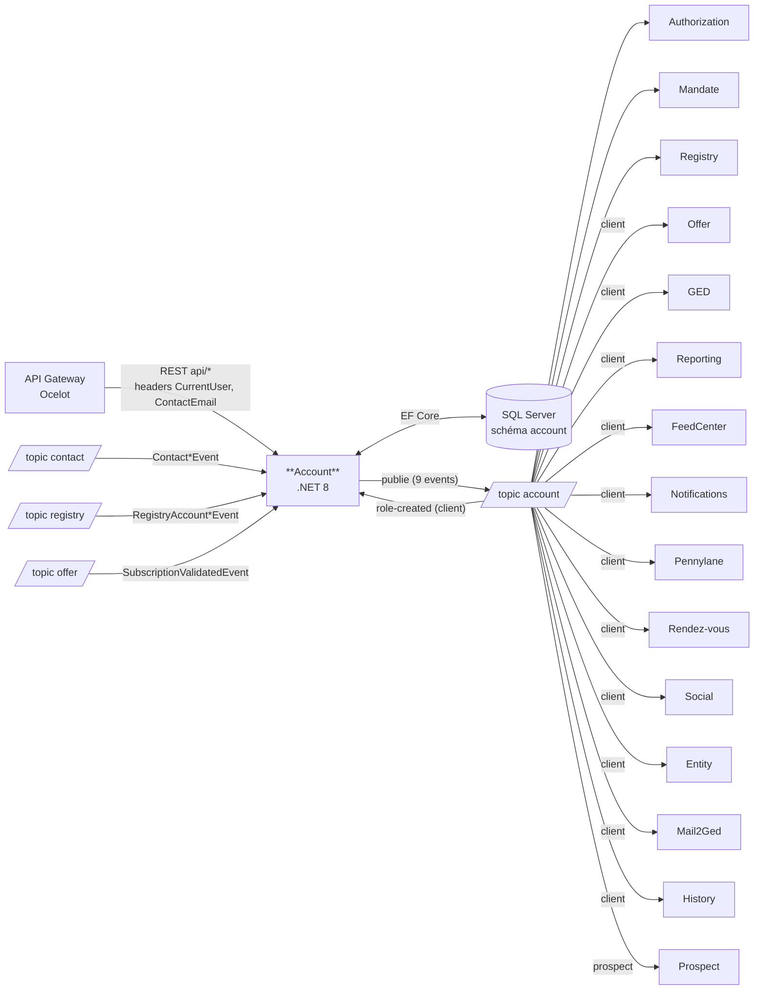

# Pulse.Back.Account — Architecture & Service Context

> **Document hybride humain / agent IA.**
> Les sections marquées `AUTO` sont régénérées automatiquement à partir du code et de
> `Pulse.Operations.Infrastructure/src/environment/hub/configuration/servicebus.yaml`.
> Les sections marquées `MANUEL` sont maintenues par l'équipe.
>
> Dernière génération : 2026-07-03 — sources : code du repo + servicebus.yaml (repo infra)
>
> Point d'entrée agents : [`AGENTS.md`](./AGENTS.md) (conventions) → ce fichier `ARCHITECTURE.md` (contexte du service).

---

## 1. Rôle du service `MANUEL`

Le service **Account** est le référentiel des **comptes clients et prospects** de la plateforme Pulse.
Il gère :

- Le cycle de vie des comptes (création, mise à jour, suppression) et leur type (`client` / `prospect`)
- Les **rôles** des contacts sur les comptes (signataire, relation client, sous-rôles) et leurs labels
- Les **délégations** entre contacts (demandes, acceptation, refus, éligibilité)
- Les favoris, l'éligibilité et l'activation des offres
- Les référentiels transverses : hubs, codes NAF, bureaux (offices)
- Des statistiques (relation client, indicateurs comptes, comptage d'entités)
- L'exposition de données comptes pour **Ventya** (dont statut "demat-ready")

C'est un service **cœur** : 15+ services consomment ses events (voir §4).

### Vue d'ensemble des flux `AUTO`

<!-- AUTO:BEGIN context-diagram -->

<!-- AUTO:END context-diagram -->

---

## 2. Données possédées `AUTO`

<!-- AUTO:BEGIN entities -->
| Entité | Description |
|--------|-------------|
| `AccountEntity` | Compte client ou prospect (racine) |
| `ContactEntity` | Projection locale des contacts (source : service Contact) |
| `RoleEntity` / `RoleLabelEntity` / `LabelEntity` | Rôles des contacts sur les comptes et leurs labels |
| `DelegationEntity` / `DelegationRequestEntity` | Délégations et demandes de délégation |
| `OfferEligibilityEntity` | Éligibilité des comptes aux offres |
| `AddressEntity` / `PhoneEntity` | Coordonnées des comptes |
| `HubEntity` / `NafEntity` / `OfficeEntity` | Référentiels (hubs, codes NAF, bureaux) |
| `DeploymentEntity` | Suivi de déploiement |

- Base : **SQL Server** (projet `Account.Database`, schéma `account`, collation CI_AS)
- Accès : **EF Core 9.0.2** (`Account.Infrastructure/Context`)
<!-- AUTO:END entities -->

---

## 3. API exposée `AUTO`

> **Contrat de référence : OpenAPI** (Swashbuckle) — `swagger/v1/swagger.json` sur l'instance, XML docs dans `Account.API/SwaggerUI.xml`.
> La table ci-dessous est un **index généré** depuis les controllers ; en cas de divergence, l'OpenAPI fait foi.

Préfixe : `api/`. Authentification portée par la **Gateway** (headers `CurrentUser` / `ContactEmail` injectés) — pas de `[Authorize]` local.

<!-- AUTO:BEGIN endpoints -->
### AccountController — `api/accounts`
| Méthode | Route | Description |
|---------|-------|-------------|
| POST | `api/accounts` | Créer un compte |
| GET | `api/accounts` | Lister les comptes (contexte utilisateur) |
| GET | `api/accounts/all` | Lister tous les comptes |
| GET | `api/accounts/search` | Rechercher des comptes |
| GET | `api/accounts/{accountId}` | Détail d'un compte |
| PATCH | `api/accounts/{accountId}` | Mettre à jour un compte |
| GET | `api/accounts/{accountId}/summary` | Synthèse du compte |
| GET | `api/accounts/{accountId}/contacts` | Contacts du compte |
| GET | `api/accounts/{accountId}/contacts/widget` | Contacts (vue widget) |
| GET | `api/accounts/contacts` | Contacts (contexte utilisateur) |
| GET | `api/accounts/contacts/{contactId}/is-prospect-only` | Le contact est-il uniquement prospect ? |

### RolesController — `api/roles`
| Méthode | Route | Description |
|---------|-------|-------------|
| GET | `api/roles` | Rôles (contexte) |
| GET | `api/roles/signatory/{accountId}` | Signataire du compte |
| GET | `api/roles/check` | Vérifier un rôle |
| GET | `api/roles/check-contact-role-on-account` | Vérifier le rôle d'un contact sur un compte |
| POST | `api/roles` | Créer un rôle |
| POST | `api/roles/bulk` | Créer des rôles en masse |
| PATCH | `api/roles` | Mettre à jour un rôle |
| PATCH | `api/roles/customer-relation` | Mettre à jour la relation client |
| DELETE | `api/roles` | Supprimer un rôle |

### DelegationController — `api/delegations`
| Méthode | Route | Description |
|---------|-------|-------------|
| GET | `api/delegations/{delegateeId}` | Délégations d'un délégataire |
| GET | `api/delegations/delegator` | Délégations du délégant |
| GET | `api/delegations` | Lister les délégations |
| POST | `api/delegations` | Créer une délégation |
| DELETE | `api/delegations` | Supprimer une délégation |
| POST | `api/delegations/requests` | Créer une demande de délégation |
| GET | `api/delegations/requests/sent` | Demandes envoyées |
| GET | `api/delegations/requests/received` | Demandes reçues |
| GET | `api/delegations/requests/eligibility` | Éligibilité à la demande |
| POST | `api/delegations/requests/accept` | Accepter une demande |
| POST | `api/delegations/requests/refuse` | Refuser une demande |

### Autres controllers
| Méthode | Route | Controller | Description |
|---------|-------|------------|-------------|
| GET | `api/favorites` | Favorite | Lister les favoris |
| PATCH | `api/favorites` | Favorite | Modifier les favoris |
| GET | `api/labels` | Label | Lister les labels |
| POST / DELETE | `api/role-labels` | RoleLabel | Associer / dissocier un label de rôle |
| PATCH | `api/activate-offer/{accountId}` | OfferEligibility | Activer une offre |
| GET | `api/referentials/hubs` \| `nafs` \| `offices` \| `AccountReferentialInformation` | Referential | Référentiels |
| GET | `api/statistics`, `api/account-customer-relation`, `api/entity-count-by-type`, `api/account-client-indicators` | Statistics | Statistiques |
| GET | `api/ventya/accounts/{accountId}` | Ventya | Compte (vue Ventya) |
| GET | `api/ventya/accounts/{accountId}/demat-ready` | Ventya | Statut demat-ready |
<!-- AUTO:END endpoints -->

---

## 4. Events PUBLIÉS `AUTO`

Topic de publication : **`account`** (via `Pulse.Back.Events`, propriétés de filtrage : `EventType`, `AccountType`).
Consommateurs extraits de `servicebus.yaml` (repo infra) — **source de vérité du déploiement**.

<!-- AUTO:BEGIN published-events -->
| Event | Déclencheur | Consommateurs (tous types) | Consommateurs (client uniquement) | Consommateurs (prospect uniquement) |
|-------|-------------|----------------------------|-----------------------------------|-------------------------------------|
| `AccountCreatedEvent` | Création de compte | authorization, mandate, registry | entity, ged, offer, reporting, social, feedcenter, notifications, mail2ged, pnl, rdv | prospect |
| `AccountUpdatedEvent` | Mise à jour de compte | authorization, mandate, registry | offer, reporting, social, pnl, rdv | prospect |
| `AccountRemovedEvent` | Suppression de compte | authorization, mandate, registry | entity, ged, offer, reporting, social, feedcenter, mail2ged, pnl, rdv | prospect |
| `RoleCreatedEvent` | Création de rôle / délégation | authorization, mandate, registry | pnl, entity, ged, social, rdv, feedcenter, notifications, **account (lui-même)** | prospect |
| `RoleUpdatedEvent` | Mise à jour de rôle | authorization | feedcenter, notifications | — |
| `RoleDeletedEvent` | Suppression de rôle | authorization, mandate, registry | pnl, entity, ged, social, rdv, feedcenter, notifications | prospect |
| `HistoryCreatedEvent` | Activité sur un compte | — | history | — |
| `OfferActivatedEvent` | Activation d'une offre | — | reporting | — |
| `ReportCreatedEvent` | Création d'un rapport | — | feedcenter | — |

⚠️ **Anomalie détectée** : la subscription `role-removed-pnl` (servicebus.yaml) filtre sur `EventType = 'RoleRemovedEvent'`, mais Account publie `RoleDeletedEvent`. Subscription probablement morte — à vérifier côté infra.
<!-- AUTO:END published-events -->

> ⚠️ **Règle anti-régression** : ne jamais supprimer ni renommer un champ d'un event publié
> (breaking change silencieux pour tous les consommateurs ci-dessus). Ajout de champ uniquement.
> Toute modification d'un event impacte la liste des services ci-dessus : les prévenir / tester.

---

## 5. Events CONSOMMÉS `AUTO`

Subscriptions configurées dans `appsettings` (`PullTopics`) ; handlers enregistrés dans `ServicesConfiguration.cs` (keyed services par `EventType`).

<!-- AUTO:BEGIN consumed-events -->
| Event | Topic source | Subscription | Handler | Producteur |
|-------|--------------|--------------|---------|------------|
| `ContactCreatedEvent` | `contact` | `contact-created-account` | `ContactCreatedEventHandler` | Contact |
| `ContactUpdatedEvent` | `contact` | `contact-updated-account` | `ContactUpdatedEventHandler` | Contact |
| `ContactRemovedEvent` | `contact` | `contact-removed-account` | `ContactRemovedEventHandler` | Contact |
| `RegistryAccountCreatedEvent` | `registry` | `registry-accountCreated-account` | `RegistryAccountCreatedEventHandler` | Registry |
| `RegistryAccountUpdatedEvent` | `registry` | `registry-accountUpdated-account` | `RegistryAccountUpdatedEventHandler` | Registry |
| `RegistryAccountRemovedEvent` | `registry` | `registry-accountRemoved-account` | `RegistryAccountRemovedEventHandler` | Registry |
| `RoleCreatedEvent` | `account` (soi-même) | `role-created-account` (filtre client) | `RoleCreatedEventHandler` | Account |
| `SubscriptionValidatedEvent` | `offer` | `offer-validated-account` | `SubscriptionValidatedEventHandler` | Offer |

**Handlers enregistrés sans subscription dans `appsettings.json`** (config probablement portée par Azure App Configuration selon l'environnement — à confirmer) :
`RegistryRoleCreatedEventHandler`, `RegistryRoleRemovedEventHandler`, `ReportCreatedEventHandler`
<!-- AUTO:END consumed-events -->

> Les handlers doivent être **idempotents** (vérifier l'existence avant `AddAsync`) —
> jamais de `catch (Exception) { return; }` (= perte de message).

---

## 6. Dépendances `AUTO`

<!-- AUTO:BEGIN dependencies -->
| Type | Cible | Usage |
|------|-------|-------|
| Base de données | SQL Server (schéma `account`) | EF Core 9.0.2, projet SSDT `Account.Database` |
| Messaging | Azure Service Bus | `Pulse.Back.Events` 2.74.179 — push : `account` ; pull : `contact`, `registry`, `account`, `offer` |
| Package Pulse | `Pulse.ExceptionMiddleware` 2.73.53 | Gestion d'erreurs (**legacy**, voir §7) |
| Feature flags | ConfigCat (via OpenFeature 2.3.0) | Flags dans `Account.API/FeatureFlags` |
| Observabilité | Azure Monitor OpenTelemetry, Serilog | Logs structurés, traces |
| Résilience | Polly 8.5.2 | Retries |
| Identité | Managed Identity (`Azure.Identity`) | Accès Service Bus / ressources Azure |
| Export | ClosedXML | Génération Excel (statistiques) |
| **Appels HTTP sortants** | **Aucun** | Pas de `AddHttpClient` — communication uniquement par events |
<!-- AUTO:END dependencies -->

---

## 7. État migration `AUTO`

<!-- AUTO:BEGIN migration-status -->
| Sujet | État actuel | Cible |
|-------|-------------|-------|
| .NET | **net8.0** (tous projets) | .NET 10 / C# 13 (migration en cours à l'échelle de la plateforme) |
| EF Core | 9.0.2 | EF Core 10 |
| Exceptions | `Pulse.ExceptionMiddleware` (`UseExceptionMiddleware()` dans `Startup.cs:93`) | `IExceptionHandler` + ProblemDetails (RFC 9457) |
| Hosting model | `Startup.cs` + `Program.cs` (ancien modèle) | Minimal hosting (`Program.cs` seul) |
<!-- AUTO:END migration-status -->

---

## 8. Structure & tests `AUTO`

<!-- AUTO:BEGIN structure -->
```
01_account/
├── src/
│   ├── Account.API/            # Controllers, Startup, config, feature flags
│   ├── Account.Core/           # Services métier, interfaces, modèles, requests
│   ├── Account.Infrastructure/ # EF Core, repositories, publishers/handlers Service Bus
│   └── Account.Database/       # Projet SSDT (schéma SQL, scripts post-déploiement)
├── tests/
│   ├── Account.Api.Tests/
│   ├── Account.Core.Tests/
│   └── Account.Infrastructure.Tests/
└── pipelines/                  # CI/CD Azure DevOps
```
<!-- AUTO:END structure -->

---

## 9. Règles spécifiques au service `MANUEL`

- La distinction `client` / `prospect` (`AccountType`) conditionne le routage des events — toujours renseigner `AccountType` lors d'une publication.
- `ContactEntity` est une **projection** alimentée par les events du service Contact : ne jamais la modifier via l'API sans passer par les handlers.
- Les rôles pilotent les autorisations en aval (service Authorization consomme tous les events de rôle sans filtre).
