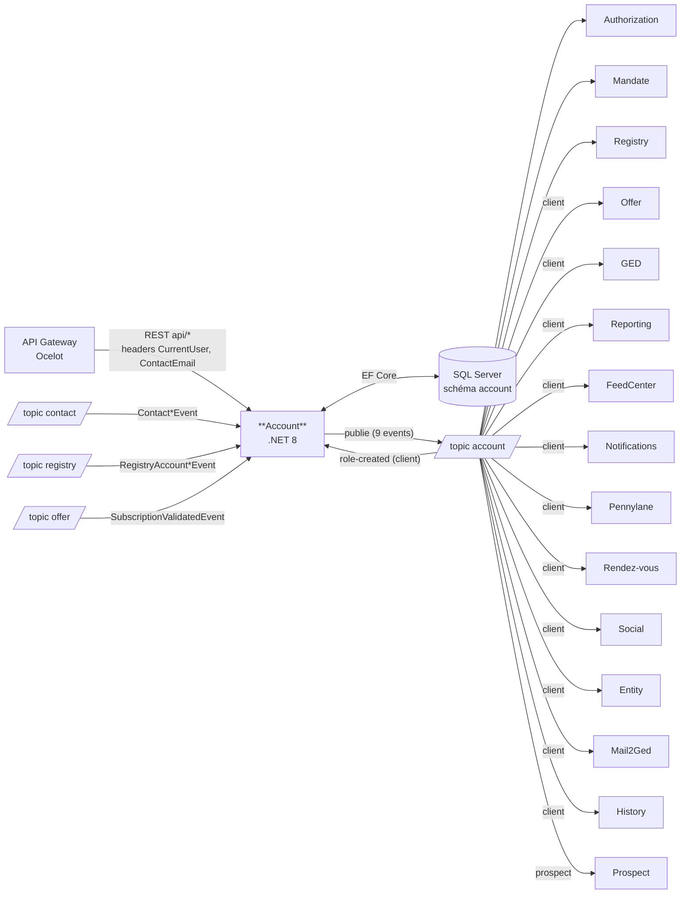

# Pulse.Back.Account — Architecture & Service Context

> **Document de contexte humain / agent IA.**
> L'inventaire factuel (endpoints, events publiés/consommés, handlers, projets, packages internes)
> est porté par [`architecture.graph.yaml`](./architecture.graph.yaml), **régénéré automatiquement sur `main`**
> par la pipeline ArchGraph, et consolidé dans `pulse.graph.yaml` (topics, subscriptions, consommateurs)
> et `events.catalog.yaml` (payloads des events) côté Pulse.Operations.Review.
> **Ne pas dupliquer ces listes ici** — ce document porte ce que le graphe ne dit pas :
> rôle métier, invariants, points d'attention, règles spécifiques.
>
> Point d'entrée agents : [`AGENTS.md`](./AGENTS.md) (conventions) → ce fichier (contexte) → le graphe (facts).

---

## 1. Rôle du service

Le service **Account** est le référentiel des **comptes clients et prospects** de la plateforme Pulse.
Il gère :

- Le cycle de vie des comptes (création, mise à jour, suppression) et leur type (`client` / `prospect`)
- Les **rôles** des contacts sur les comptes (signataire, relation client, sous-rôles) et leurs labels
- Les **délégations** entre contacts (demandes, acceptation, refus, éligibilité)
- Les favoris, l'éligibilité et l'activation des offres
- Les référentiels transverses : hubs, codes NAF, bureaux (offices)
- Des statistiques (relation client, indicateurs comptes, comptage d'entités)
- L'exposition de données comptes pour **Ventya** (dont statut "demat-ready")

C'est un service **cœur** : 15+ services consomment ses events (voir §4).

### Vue d'ensemble des flux

> Vue synthétique **indicative** — la source de vérité de la topologie est le graphe consolidé `pulse.graph.yaml`.



---

## 2. Données possédées

| Entité | Description |
|--------|-------------|
| `AccountEntity` | Compte client ou prospect (racine) |
| `ContactEntity` | Projection locale des contacts (source : service Contact) |
| `RoleEntity` / `RoleLabelEntity` / `LabelEntity` | Rôles des contacts sur les comptes et leurs labels |
| `DelegationEntity` / `DelegationRequestEntity` | Délégations et demandes de délégation |
| `OfferEligibilityEntity` | Éligibilité des comptes aux offres |
| `AddressEntity` / `PhoneEntity` | Coordonnées des comptes |
| `HubEntity` / `NafEntity` / `OfficeEntity` | Référentiels (hubs, codes NAF, bureaux) |
| `DeploymentEntity` | Suivi de déploiement |

- Base : **SQL Server** (projet `Account.Database`, schéma `account`, collation CI_AS)
- Accès : **EF Core** (`Account.Infrastructure/Context`)

---

## 3. API exposée

**Liste exhaustive des endpoints : [`architecture.graph.yaml`](./architecture.graph.yaml)** (section
`managed_by_script.endpoints`). Contrat de référence : **OpenAPI** (Swashbuckle) — `swagger/v1/swagger.json`
sur l'instance, XML docs dans `Account.API/SwaggerUI.xml` ; en cas de divergence, l'OpenAPI fait foi.

- Préfixe : `api/`. Principaux domaines : comptes (`api/accounts`), rôles (`api/roles`), délégations
  (`api/delegations`), favoris, labels, éligibilité offres, référentiels (hubs/NAF/bureaux), statistiques, vue Ventya.
- Authentification portée par la **Gateway** (headers `CurrentUser` / `ContactEmail` injectés) — pas de `[Authorize]` local.

---

## 4. Events publiés

**Liste de référence : le graphe** (fragment + consolidé, croisés avec `servicebus.yaml` du repo infra —
source de vérité du déploiement). Ce qui suit est le **contexte métier** des publications.

Topic de publication : **`account`** (via `Pulse.Back.Events`, propriétés de filtrage : `EventType`, `AccountType`).

| Event | Déclencheur |
|-------|-------------|
| `AccountCreatedEvent` | Création de compte |
| `AccountUpdatedEvent` | Mise à jour de compte |
| `AccountRemovedEvent` | Suppression de compte |
| `RoleCreatedEvent` | Création de rôle / délégation (auto-consommé via `role-created-account`) |
| `RoleUpdatedEvent` | Mise à jour de rôle |
| `RoleDeletedEvent` | Suppression de rôle |
| `HistoryCreatedEvent` | Activité sur un compte |
| `OfferActivatedEvent` | Activation d'une offre |
| `ReportCreatedEvent` | Création d'un rapport |

- Le routage des subscriptions dépend du filtre **`AccountType`** (`client` / `prospect`) : le service Prospect
  ne reçoit que les prospects, la plupart des autres consommateurs uniquement les clients (filtres visibles dans le consolidé).
- Subscription morte connue : `role-removed-pnl` filtre sur `RoleRemovedEvent`, event renommé `RoleDeletedEvent` —
  à nettoyer côté infra (documenté dans `baseline.yaml` d'ArchGraph).

> ⚠️ **Règle anti-régression** : ne jamais supprimer ni renommer un champ d'un event publié
> (breaking change silencieux pour tous les consommateurs — 15+ services, cf. graphe consolidé). Ajout de champ uniquement.
> Toute modification d'un event impacte ces services : les prévenir / tester.

---

## 5. Events consommés

**Liste exhaustive events consommés / handlers : le fragment** (`managed_by_script.events.consumes`) ;
producteurs, topics et subscriptions déployées : graphe consolidé.

- Subscriptions configurées dans `appsettings` (`PullTopics`) ; handlers enregistrés dans
  `ServicesConfiguration.cs` (keyed services par `EventType`).
- **Handlers enregistrés sans subscription dans `appsettings.json`** (config probablement portée par
  Azure App Configuration selon l'environnement — à confirmer) :
  `RegistryRoleCreatedEventHandler`, `RegistryRoleRemovedEventHandler`, `ReportCreatedEventHandler`

> Les handlers doivent être **idempotents** (vérifier l'existence avant `AddAsync`) —
> jamais de `catch (Exception) { return; }` (= perte de message).

---

## 6. Dépendances

> Versions des packages internes : fragment (`managed_by_script.internal_packages`).

| Type | Cible | Usage |
|------|-------|-------|
| Base de données | SQL Server (schéma `account`) | EF Core, projet SSDT `Account.Database` |
| Messaging | Azure Service Bus | `Pulse.Back.Events` — push : `account` ; pull : `contact`, `registry`, `account`, `offer` |
| Package Pulse | `Pulse.ExceptionMiddleware` | Gestion d'erreurs (**legacy**, voir §7) |
| Feature flags | ConfigCat (via OpenFeature) | Flags dans `Account.API/FeatureFlags` |
| Observabilité | Azure Monitor OpenTelemetry, Serilog | Logs structurés, traces |
| Résilience | Polly | Retries |
| Identité | Managed Identity (`Azure.Identity`) | Accès Service Bus / ressources Azure |
| Export | ClosedXML | Génération Excel (statistiques) |
| **Appels HTTP sortants** | **Aucun** | Pas de `AddHttpClient` — communication uniquement par events |

---

## 7. État migration

| Sujet | État actuel | Cible |
|-------|-------------|-------|
| .NET | **net8.0** (tous projets) | .NET 10 / C# 13 (migration en cours à l'échelle de la plateforme) |
| EF Core | 9.x | EF Core 10 |
| Exceptions | `Pulse.ExceptionMiddleware` (`UseExceptionMiddleware()` dans `Startup.cs`) | `IExceptionHandler` + ProblemDetails (RFC 9457) |
| Hosting model | `Startup.cs` + `Program.cs` (ancien modèle) | Minimal hosting (`Program.cs` seul) |

---

## 8. Structure & tests

```
01_account/
├── src/
│   ├── Account.API/            # Controllers, Startup, config, feature flags
│   ├── Account.Core/           # Services métier, interfaces, modèles, requests
│   ├── Account.Infrastructure/ # EF Core, repositories, publishers/handlers Service Bus
│   └── Account.Database/       # Projet SSDT (schéma SQL, scripts post-déploiement)
├── tests/
│   ├── Account.Api.Tests/
│   ├── Account.Core.Tests/
│   └── Account.Infrastructure.Tests/
└── pipelines/                  # CI/CD Azure DevOps
```

---

## 9. Règles spécifiques au service

- La distinction `client` / `prospect` (`AccountType`) conditionne le routage des events — toujours renseigner `AccountType` lors d'une publication.
- `ContactEntity` est une **projection** alimentée par les events du service Contact : ne jamais la modifier via l'API sans passer par les handlers.
- Les rôles pilotent les autorisations en aval (service Authorization consomme tous les events de rôle sans filtre).

---

## 10. Invariants métier — Rôles

Un **rôle** = le lien entre un utilisateur (client ou collaborateur) et un dossier (Account).
Côté client il rend le dossier visible dans « mes entités » ; côté collaborateur il place le dossier dans le portefeuille.
Champs exposés via `customer-wallet/api/accounts` : `isCustomerRelation`, `actionLevel`, `labels`.

### Règle de fusion à la création / mise à jour d'un rôle (ne jamais contourner)

Toute écriture d'un rôle arbitre entre **3 paramètres** : la valeur **existante**, la valeur demandée par l'**appelant**, et la règle **système** :

| Champ | Règle de fusion |
|-------|-----------------|
| `labels` | **Union** : on ajoute les libellés demandés, on n'en supprime jamais implicitement |
| `isCustomerRelation` | **OR** : `true` si au moins un des 3 paramètres est `true` |
| `actionLevel` | **MAX** des 3 paramètres (0 à 4) |

Règles système : `isCustomerRelation` par défaut `false` ; si `isCustomerRelation = true` (après MAJ) alors `actionLevel = 4` ; s'il existe au moins un label (après MAJ) alors `actionLevel = 3`.

⚠️ Toute écriture directe qui écrase une de ces valeurs sans appliquer MAX / OR / union est une **régression**.

### Échelle `actionLevel`

| Valeur | Nom | Usage |
|--------|-----|-------|
| 4 | Relation client | Collaborateurs en relation client |
| 3 | Contributeur | Collaborateurs porteurs de libellés de rôle |
| 2 | Actif | Affiché par défaut dans le portefeuille (cadrage « périmètre de dossier ») |
| 1 | Passif | Masqué par défaut, exclu des statistiques (cadrage « périmètre de dossier ») |
| 0 | N/A | Champ non renseigné |

### Labels connus et leur source

| Label | Source |
|-------|--------|
| Maitre dossier (ex-AM) | Akuiteo / référentiel |
| Resp compte (ex-CLP) | Akuiteo / référentiel |
| Expert comptable | Pennylane |
| Collaborateur principal | Pennylane |
| Chef de mission | Pennylane |

- `isCustomerRelation` est dérivé automatiquement des labels : « Resp compte » ou « Maitre dossier » ⇒ en relation client.
- Un collaborateur qui perd son rôle côté Akuiteo **reste** en relation client dans la plateforme (pas de retrait automatique).
- Moments de création d'un rôle : sync Registry (Akuiteo), délégation de dossier, ajout d'un collaborateur ou d'un client sur un dossier, activation de certaines offres (ex. Pennylane).

### Délégations de dossiers

- Une délégation demandée par un collaborateur **doit être validée** par un collaborateur ayant déjà accès au dossier (décision RM : pas d'accès direct au niveau hub sans validation).
- Une demande porte sur **un seul dossier** ; les collaborateurs à notifier sont proposés par `actionLevel` décroissant (2 pré-cochés, minimum 1, maximum 3).
- La validation par **un seul** des notifiés suffit (la demande disparaît pour les autres) ; le refus de **tous** déclenche une notification de refus au demandeur.
- L'historique du dossier n'est alimenté **que si la demande est validée** : action `ADDKDELM`, catégorie `OBK-ADK`, thème `OBK`, nature Création.
- La suppression d'une **délégation permanente** n'est pas rétroactive : elle ne retire aucun dossier déjà délégué, elle stoppe seulement la délégation automatique des futurs dossiers.

### Portefeuille

- Un collaborateur ne peut **pas se retirer d'un dossier s'il en est le dernier collaborateur** (le back refuse la suppression) ; le retrait normal exige une confirmation explicite (`?confirmation=true`).
- « Me déclarer en relation client » et « Me retirer de la relation client » sont deux actions **distinctes** ; en masse, la déclaration s'applique à tous les dossiers sélectionnés, y compris ceux où le collaborateur l'est déjà.
- Cadrage « périmètre de dossier » (attribution des niveaux) : délégation automatique et délégation de tout le portefeuille ⇒ `actionLevel = 1` ; ajout d'un collaborateur sur un dossier ou délégation ciblée de 1..n dossiers ⇒ `actionLevel = 2`.
